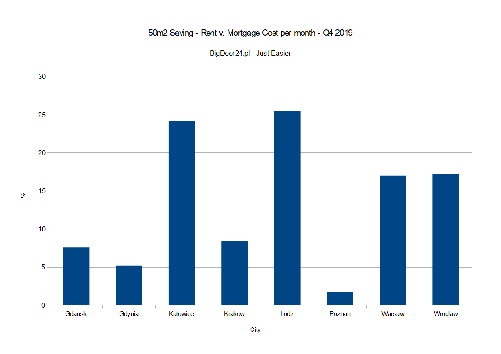

Despite, in some cases, double digit growth in property prices in Poland in the last year, we examine whether renting or buying is a better option for your finances.

Using information compiled from recent articles by [expander/rentier.io](https://www.expander.pl/raport-expandera-i-rentier-io-najem-mieszkan-iv-kw-2019/) and [money.pl](https://www.money.pl/gospodarka/ceny-mieszkan-w-polsce-rosna-lata-wyrzeczen-i-srednia-pensja-to-za-malo-6476836634400897a.html) we have compiled some graphs that may help in your decision to buy a Polish property and/or get a Polish mortgage in 2020.

To begin we look at apartment growth by City during 2019

{.img-fluid .img-responsive}

So there has been growth, but should we rent or buy?

So now we can look at the cost of renting 3 types of apartments in major Polish cities. Making a comparison of net rent ( without ancillary costs i.e. management fee, tax etc ) versus the cost of borrowing 90 % to purchase a similar property, again without any extra expenses like insurance etc.

We have displayed the results as a percentage of savings.

So for example, Warsaw has an average rent that is 22% higher than the cost of a monthly mortgage payment. In numerical terms, the average rent for a 35m2 apartment is zl. 2,425 and a monthly mortgage payment for a similar apartment would be zl. 1982 making a saving of zl 443. Therefore  renting is 22 % more expensive than buying.

## **35 m2 Apartment**

{.img-fluid .img-responsive}

## **50 m2 Apartment**

{.img-fluid .img-responsive}

***[Did you know? BigDoor24.pl pays you zl. 200 per zl. 100,000 borrowed when you find a Polish Mortgage Advisor through BigDoor24.pl. (With zl. 250 for a successful Applicant referral - register for your personal referral code)](https://bigdoor24.pl/)***

## 70 m2 Apartment

{.img-fluid .img-responsive}

We can see a striking difference between the smaller and larger apartments which might suggest that if you are considering buying an apartment for investment it may be better to buy two smaller ones rather than one larger.

The above figures come from a recent report from Expander/ Rentior.io and covers data from the period October 1 2019 to 31 December 2019. Whilst BigDoor24 may disagree slightly with some of the averages, we feel the differences aren't enough to fundamentally change the basic message of the data.

Happy Hunting

Team BigDoor24.pl - Just Easier

**About BigDoor24.pl**

[Bigdoor24.pl is a new free service for Expats, finding Property Experts (Mortgage Advisors & Real Estate Agents) who speak your language, securing Commission Discounts & paying you a Mortgage CashBack.](https://bigdoor24.pl/)
