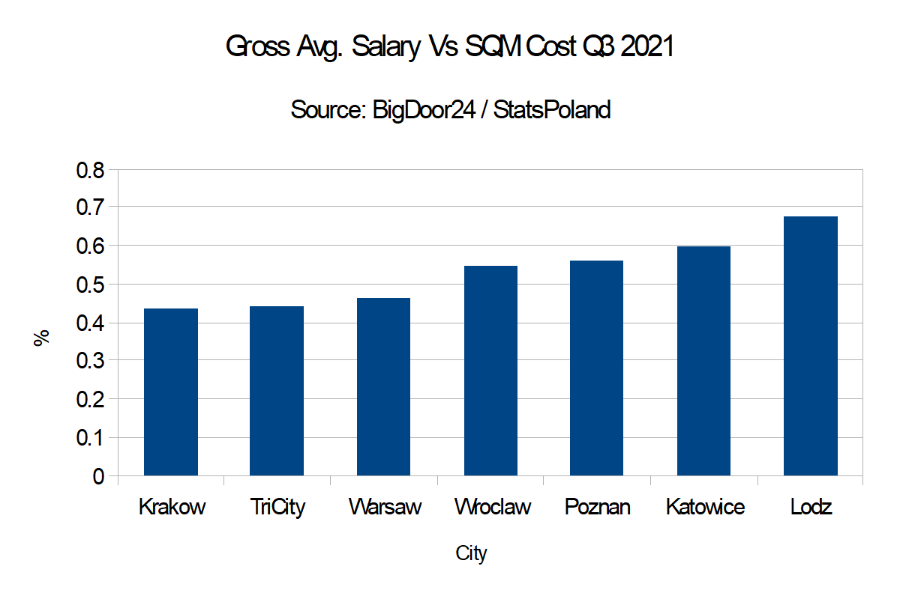

StatsPoland have just announced [regional average gross salary levels](https://stat.gov.pl/en/latest-statistical-news/communications-and-announcements/list-of-communiques-and-announcements/average-monthly-gross-wages-and-salaries-in-national-economy-in-voivodships-in-2020,306,7.html) around Poland and we thought it would be a good opportunity to compare them to average apartment costs in each major city.

We would preface this with the obvious caveat that the salaries are vovoidship based and city salaries are higher but the relative comparison should give us an indication of which cities offer more  affordability.

Using data both internal to BigDoor24.pl and an amalgam of the main property platforms we can see the following.

The chart above essentially asks the question, "How many square metres can a monthly gross salary buy?". In essence, it portrays the affordability of property and the difference between Krakow an Lodz is striking.

At the same time it, we would argue that these disparities will probably continue to prevail into the future with possibly Wroclaw moving closer to the top three of Krakow, TriCity and Warsaw. With salaries unlikely to fall, this would suggest that Wroclaw is the place to watch for future price rises.

[For more detail on City specific property please have a look at our previous article - Which Polish City Offers the Best Return on your Investment? - March 2021](https://blog.bigdoor24.pl/posts/2021-03-08-which-polish-city-offers-the-best-return-on-your-investment-march-2021.html)

Happy hunting,

Team BigDoor24.pl - Just Easier

[BigDoor24.pl is a free service that finds local Polish Property Professionals who speak your language. An official referral agent for OpenFinance, Expander and other National Mortgage Advisors, **BigDoor24 Pays You** when you successfully complete your mortgage application. Click here for more details.](https://bigdoor24.pl/)